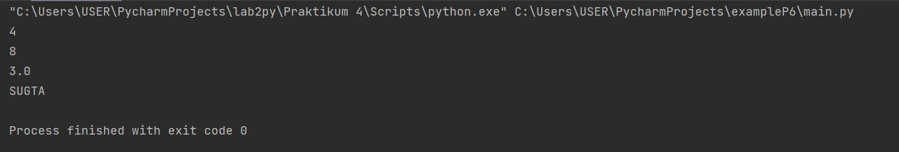
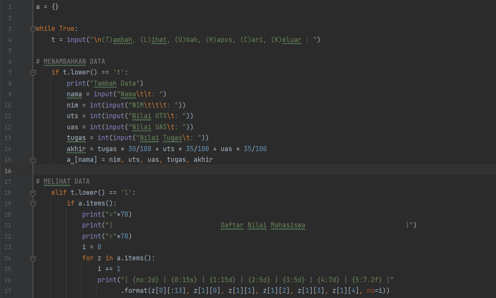
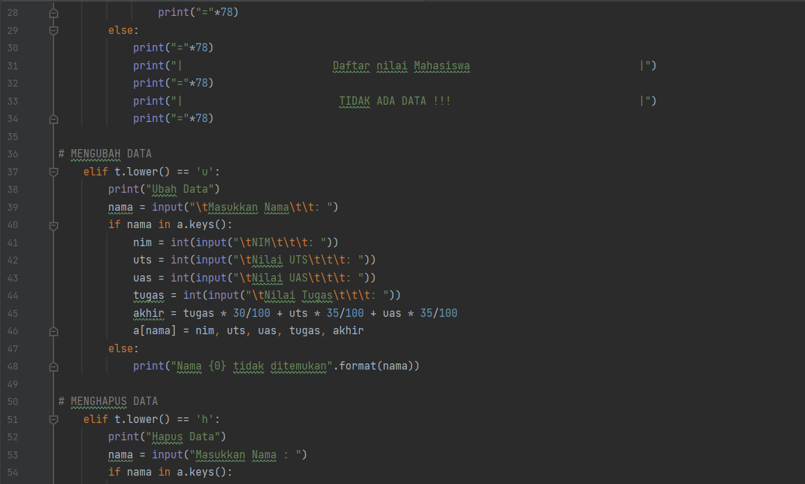
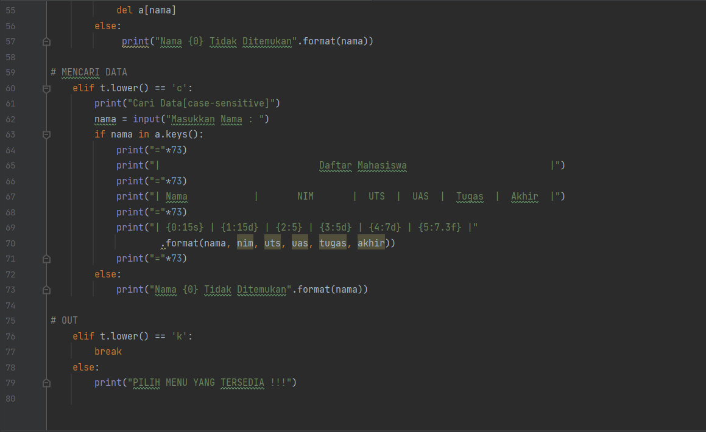
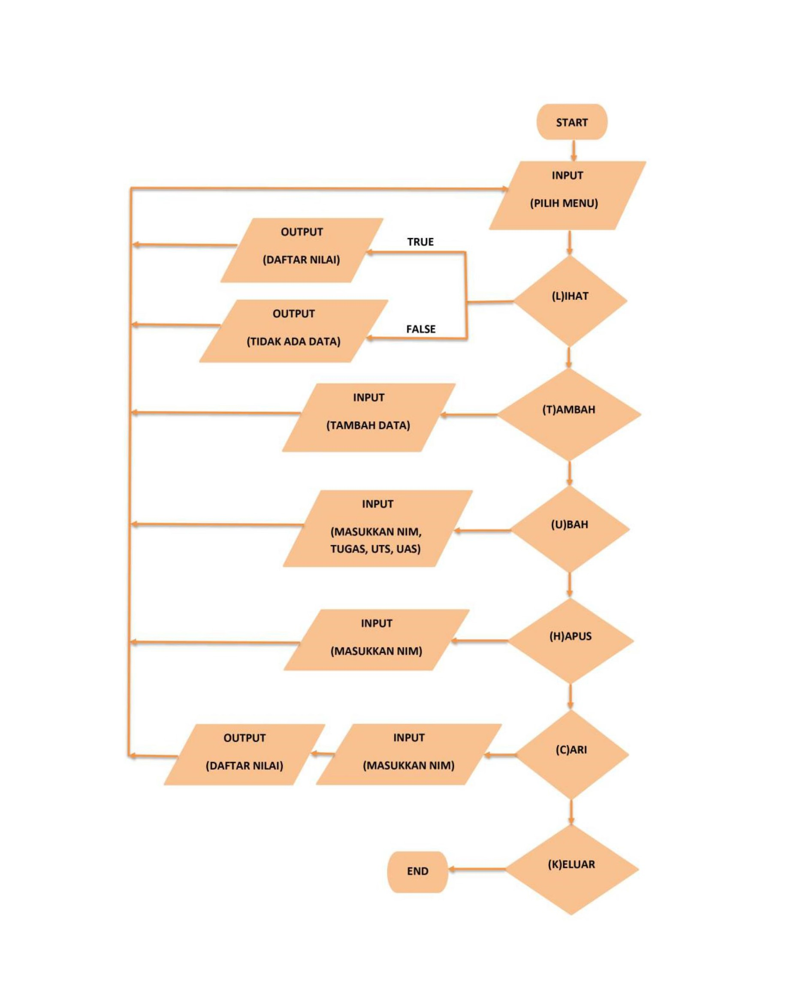
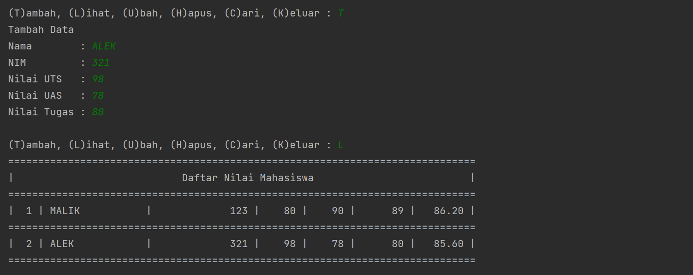
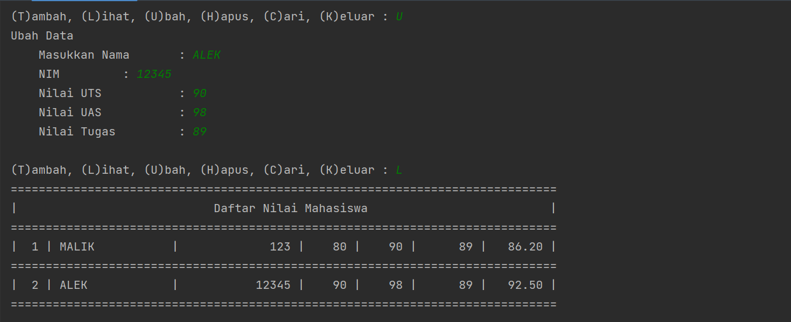
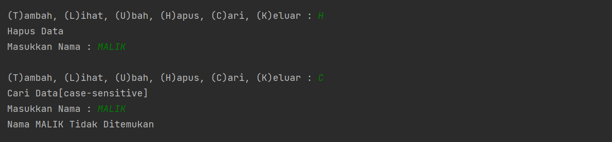
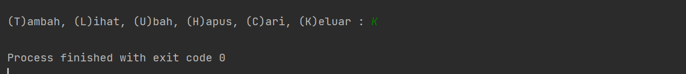

## Nama         :   Ghufron Malik
## Kelas        :   TI.22.B2
## Mata kuliah  :   Bahasa Pemrograman

| No |    DAFTAR ISI    |  LINK  |
|----|----------------  |--------|
| 1  |Latihan 1         |[Click](https://github.com/ghufronmalik64/labpy06.git#Latihan-1)|
| 2  |Tugas Praktikum   |[Click](https://github.com/ghufronmalik64/labpy06.git#Tugas-Praktikum) |
| 3  |Penjelasan        |[Click](https://github.com/ghufronmalik64/labpy06.git#Penjelasan) |
| 4  |Hasil Output      |[Click](https://github.com/ghufronmalik64/labpy06.git#Hasil-Output) |


# Latihan 1


### Source Code
```py
import math

def a(x):
    return  x**2
a = lambda x : x**2
print(a(2))
def b(x, y):
        return math.sqrt(x**2 + y**2)

b = lambda x, y : x ** 2 + y ** 2
print(b(2, 2))
def c(*args):
        return sum(args)/len(args)

c = lambda *args : sum(args)/len(args)
print(c(1,2,3,4,5))
def d(s):
        return "".join(set(s))

d = lambda s: "".join(set(s))
print(d("TUGAS"))
```
### Output



# Tugas Praktikum

Berikut adalah tampilan program sederhana dengan mengaplikasikan penggunaan fungsi yang akan menampilkan daftar nilai mahasiswa, dengan ketentuan:
- Fungsi tambah() untuk menambah data
- Fungsi tapilkan() untuk menampilkan data
- Fungsi hapus(nama) untuk menghapus data berdasarkan nama dan
- Fungsi ubah(nama) untuk mengubah data berdasarkan nama

### Program




### Flowchart


## Penjelasan

### 1. Membuat Dictonary
- Hal pertama membuat dictonary kosong dengan syntax `a = {}` . Fungsinya untuk menginput data dalam program tersebut dan memudahkan kita untuk memanggil data itu lagi.

### 2. Membuat Perulangan
- Selanjutnya membuat kondisi perulangan menggunakan `while True`. Artinya ketika kita menginputkan data berdasarkan syntax maka jawabannya benar jika tidak maka akan break. Untuk menginisialkan penambahan menu pilihan Tambah, Lihat, Ubah, Hapus, Cari, dan Keluar menggunakan source code sebagai berikut :
``` py
while True:
    t = input("\n(T)ambah, (L)ihat, (U)bah, (H)apus, (C)ari, (K)eluar : ")
```

### 3. Menambahkan Data
- Disini apabila kita menginputkan `T` maka kita akan diminta untuk menginputkan beberapa data. Data yang kita inputkan akan masuk ke dictionary `a` yang telah dibuat tadi dengan data `nama` sebagai keys dan sisanya sebagai values.
```py
    if t.lower() == 't':
        print("Tambah Data")
        nama = input("Nama\t\t: ")
        nim = int(input("NIM\t\t\t: "))
        uts = int(input("Nilai UTS\t: "))
        uas = int(input("Nilai UAS\t: "))
        tugas = int(input("Nilai Tugas\t: "))
        akhir = tugas * 30/100 + uts * 35/100 + uas * 35/100
        a [nama] = nim, uts, uas, tugas, akhir
```

### 4. Melihat Data
- Apabila kita menginput `L` maka sistem akan menampilkan data yang sudah kita masukkan. Jika kita belum memasukkan data maka outputnya menjadi **TIDAK ADA DATA**.
- Data dalam perulangan `for` di ambil dari variabel Dictionary `a` pada bagian value yang berbntuk list. variabel `i = 0` digunakan untuk membuat nomer.
```py
    elif t.lower() == 'l':
        if a.items():
            print("="*78)
            print("|                            Daftar Nilai Mahasiswa                          |")
            print("="*78)
            i = 0
            for z in a.items():
                i += 1
                print("| {no:2d} | {0:15s} | {1:15d} | {2:5d} | {3:5d} | {4:7d} | {5:7.2f} |"
                      .format(z[0][:13], z[1][0], z[1][1], z[1][2], z[1][3], z[1][4], no=i))
                print("="*78)
        else:
            print("="*78)
            print("|                        Daftar Nilai Mahasiswa                           |")
            print("="*78)
            print("|                         TIDAK ADA DATA !!!                              |")
            print("="*78)
```

### 5. Mengubah Data
- Apabila kita menginput `U` maka akan ada keterangan untuk mengubah data dan kita akan diminta untuk menginputkan nama yang mau diubah datanya, apabila nama tidak ada maka outputnya **Nama {} tidak ditemukan**. Dimana `{}` adalah nama/data yang mau kita ubah.
    ```py
    elif t.lower() == 'u':
        print("Ubah Data")
        nama = input("\tMasukkan Nama\t\t: ")
        if nama in a.keys():
            nim = int(input("\tNIM\t\t\t: "))
            uts = int(input("\tNilai UTS\t\t\t: "))
            uas = int(input("\tNilai UAS\t\t\t: "))
            tugas = int(input("\tNilai Tugas\t\t\t: "))
            akhir = tugas * 30/100 + uts * 35/100 + uas * 35/100
            a[nama] = nim, uts, uas, tugas, akhir
        else:
            print("Nama {0} tidak ditemukan".format(nama))

### 6. Menghapus Data
- Apabila kita menginput `H` maka kita akan diminta menginput nama yang akan dihapus. Jika nama ada di dalam dictionary, maka system akan menghapus keys/nama tersebut beserta valuesnya pada statement `del a[nama]`.
    ```py
    elif t.lower() == 'h':
        print("Hapus Data")
        nama = input("Masukkan Nama : ")
        if nama in a.keys():
            del a[nama]
        else:
             print("Nama {0} Tidak Ditemukan".format(nama))
    ```

### 7. Mencari Data
- Apabila kita menginputkan `C` maka kita akan diminta untuk memasukkan nama yang akan dicari. Apabila nama yang dicari ada di dalam dictionary maka outputnya akan menampilkan data dari nama tersebut.
```py
    elif t.lower() == 'c':
        print("Cari Data[case-sensitive]")
        nama = input("Masukkan Nama : ")
        if nama in a.keys():
            print("="*73)
            print("|                       Daftar Nilai Mahasiswa                          |")
            print("="*73)
            print("| Nama            |       NIM       |  UTS  |  UAS  |  Tugas  |  Akhir  |")
            print("="*73)
            print("| {0:15s} | {1:15d} | {2:5} | {3:5d} | {4:7d} | {5:7.3f} |"
                    .format(nama, nim, uts, uas, tugas, akhir))
            print("="*73)
        else:
            print("Nama {0} Tidak Ditemukan".format(nama))
```

### 8. Keluar Dari Program
- Untuk menghentikan perulangan/keluar dari program kita bisa menginput `K`. Maka semua perulangan akan berhenti/keluar dari program.
```py
    elif t.lower() == 'k':
        break
    else:
        print("PILIH MENU YANG TERSEDIA !!!")
```

## Hasil Output

Apabila program dijalankan maka akan menghasilkan output sebagai berikut :

 - Menambahkan Data dengan input `T` dan melihat data dengan input `L`

 
 - Mengubah Data dengan input `U` dan melihat data dengan input `L`


- Menghapus Data dengan input `H` dan mencari data dengan input `C`


- Keluar dari program dengan input `K`



# **Thank you may be useful** 