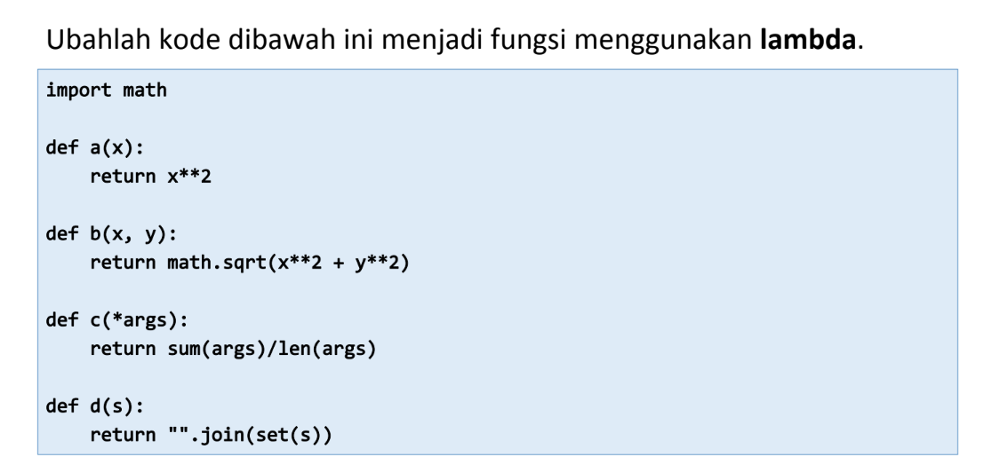

## Nama         :   Ghufron Malik
## Kelas        :   TI.22.B2
## Mata kuliah  :   Bahasa Pemrograman


# Latihan 1


### Source Code
```py
import math

def a(x):
    return  x**2
a = lambda x : x**2
print(a(2))
def b(x, y):
        return math.sqrt(x**2 + y**2)

b = lambda x, y : x ** 2 + y ** 2
print(b(2, 2))
def c(*args):
        return sum(args)/len(args)

c = lambda *args : sum(args)/len(args)
print(c(1,2,3,4,5))
def d(s):
        return "".join(set(s))

d = lambda s: "".join(set(s))
print(d("TUGAS"))
```
### Output
